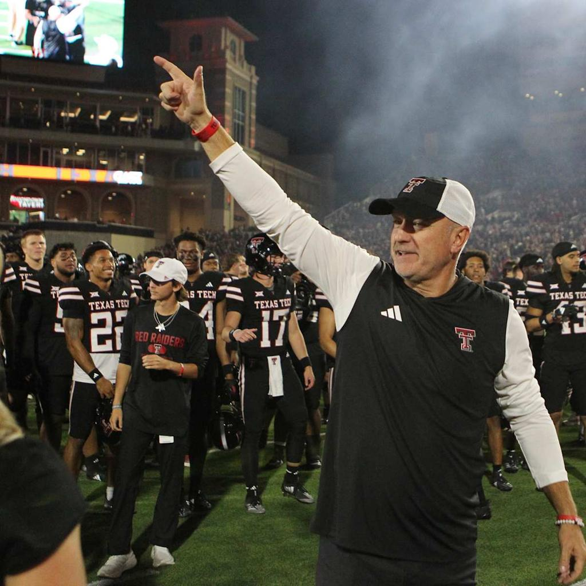

# Joey McGuire

Joey McGuire is the current head football coach at Texas Tech University. He was hired by Texas Tech in November 2021 after previously spending five seasons on the coaching staff at Baylor University.

## Before Texas Tech

Before making the jump to college football, Coach McGuire built a very successful career as a high school football coach in Texas. A true Friday night lights legend, he spent 14 seasons as the head coach at Cedar Hill High School, where he helped build one of the most successful football programs in the state.

McGuire led Cedar Hill to three state championships and developed strong relationships throughout Texas high school football. Those connections have continued to play an important role in his recruiting approach at Texas Tech.

## Becoming the Red Raiders Head Coach

Texas Tech hired Coach McGuire to lead the Red Raider football program during the 2021 season. His energy, personality, and knowledge of the Texas football landscape quickly became an important part of his approach to building the program.

He has placed a strong emphasis on recruiting Texas players and building excitement around the program.

## Building the Program

Under McGuire, Texas Tech has continued working toward becoming a consistent contender in the Big 12. The Red Raiders won the 2025 Big 12 Championship, giving Texas Tech its first outright conference championship since 1955.

His leadership has helped bring new attention and expectations to the football program while continuing to build the Matador culture.

## Related Pages

- [[coaches/index|Coaches]]
- [[football-history/index|Texas Tech Football History]]
- [[players/patrick-mahomes|Patrick Mahomes]]