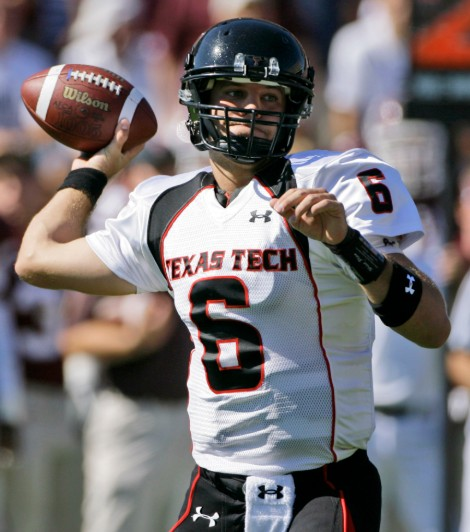

# Graham Harrell

Graham Harrell was one of the most successful quarterbacks in Texas Tech football history. He played for the Red Raiders from 2005 to 2008 and became known for putting up big passing numbers in Texas Tech's Air Raid offense.

## Career at Texas Tech

Harrell became the starting quarterback in 2006 and helped lead one of the most productive offenses in college football. During his career, he threw for more than 15,000 yards and finished with 134 passing touchdowns.

His senior season in 2008 was one of the biggest years in Texas Tech football history.

## The 2008 Season

Harrell helped lead Texas Tech to an 11-2 record during the 2008 season. One of the biggest moments came against Texas when Harrell connected with Michael Crabtree for the game winning touchdown with only seconds remaining.

The victory became arguably the greatest moment in Texas Tech history.

## Legacy

Harrell finished his Texas Tech career as one of the most productive quarterbacks in college football history. His success also helped define how effective Texas Tech's Air Raid offense could be.

## Related Pages

- [[players/index|Notable Texas Tech Players]]
- [[players/michael-crabtree|Michael Crabtree]]
- [[football-history/2008-texas-game|2008 Texas Game]]