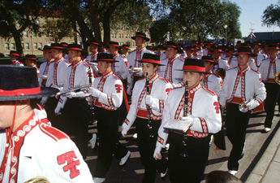

# Goin' Band from Raiderland

The Goin' Band from Raiderland is the marching band of Texas Tech University and an important part of the Red Raider game day experience. The band brings school spirit, and tradition to Texas Tech football games and other events. 

## History

The Goin' Band has a long history at Texas Tech and has become one of the university's most recognizable traditions. The band's performances have helped create the atmosphere surrounding Texas Tech athletics for generations.

## Game Day

On football game days, the Goin' Band performs throughout the stadium experience. Fans can hear the band before the game, in the stands, and during halftime.

The band's music adds to the energy inside the Jones and helps connect current students and fans with Texas Tech traditions.

## School Spirit

The Goin' Band represents more than just music. Its performances are part of the traditions that make a Texas Tech football game unique.

Along with Raider Red and the Masked Rider, the band is an important part of the identity and spirit surrounding Red Raider athletics.

## Related Pages

- [[traditions/index|Texas Tech Traditions]]
- [[traditions/raider-red|Raider Red]]
- [[traditions/masked-rider|Masked Rider]]
- [[game-day/game-day-traditions|Game Day Traditions]]
- [[stadium/jones-att-stadium|Jones AT&T Stadium]]